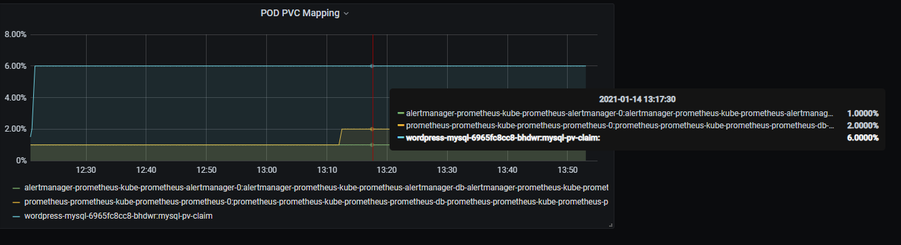

# PVC Exporter

[](https://conventionalcommits.org)
[](https://github.com/semantic-release/semantic-release)
[](https://github.com/Mario-F/pvc-exporter/pkgs/container/pvc-exporter)

This exporter provides 2 metrics, one for monitoring mounted pvc usage precent named pvc_usage, and one for provides the mapping between pod and pvc named pvc_mapping.

## Supported storage providers

Only used to monitor mounted pvc that provied by block storage provisioner.
The following storage provisioners has been confirmed to be working:

* longgorn  
* trident  
* rook-ceph  
* aliyun flexvolume  
* iomesh
* nutanix-csi

## Usage

Using the helm chart simply with this commands:

```shell
helm repo add mariof-charts https://mario-f.github.io/helm-charts/
helm install kubevis mariof-charts/pve-exporter
```

## Grafana

You can import the [pvc_usage-dashboard](./docs/pvc_usage-dashboard.json) to grafana for monitoring pvc usage.

The legend format is pod:pvc.
