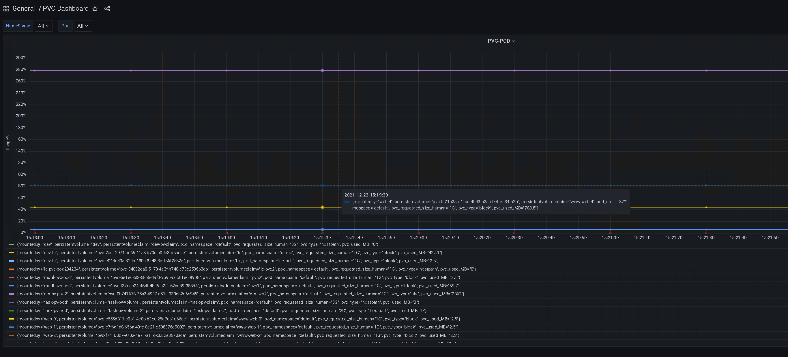

# pvc-exporter
[](https://opensource.org/licenses/Apache-2.0)
[](https://artifacthub.io/packages/search?repo=pvc-exporter)  
**As of v0.1.2**  


  
**Since v0.1.3**  

  

  

This project provides 2 metrics,one for monitoring mounted pvc usage named **"pvc_usage"**, and one for provides the mapping between pod and pvc named **"pvc_mapping"**.

# Note  
Now, the hostpath pvc and nfs pvc will be supported starting with version 0.1.3. So we currently support 3 types of pvc: hostpath, nfs, blockstorage.  
For blockstorage just supported the pvc mounted as **"volumeMounts"**. If your pv is block model and mounted as **"volumeDevices"** that not supported yet. 

**Architecture Change:**  
1. Previously, **"pvc_usage"** and **"pvc_mapping"** were divided into 2 images. Now, they have merged into one image, called **pvc-exporter**. In addition, the field of the metrics have also been changed.   
2. Based on the development of k8s, the native metrics like **kubelet_volume_stats_used_bytes** was now able to work normally and part of the demand has been met. So the **pod-pvc-mapping** project is maintained separately now, you can use this alone with the native metrics to monitoring pvc.  
3. If you want to upgrade to v0.1.3, we recommend that you uninstall old version then install new version.  

# Support list
The following storage provisioners has been tested..  
1.longgorn  
2.trident  
3.rook-ceph  
4.aliyun flexvolume  
5.iomesh  
6.nutanix-csi  
...  

The following architectures:  
1.x86_64  
2.ARM64  

 
# Usage  
```
###v0.1.2###
helm repo add pvc-exporter https://kais271.github.io/pvc-exporter/helm3/charts/  
kubectl create namespace pvc-exporter  
helm install demo pvc-exporter/pvc-exporter --namespace pvc-exporter --version v0.1.2  
    
###v0.1.3###
#This will be provide 2 metrics: pvc_usage and pvc_mapping 
helm repo add pvc-exporter https://kais271.github.io/pvc-exporter/helm3/charts/  
kubectl create namespace pvc-exporter  
helm install demo pvc-exporter/pvc-exporter --namespace pvc-exporter --version v0.1.3-beta  

#If you just want to get pvc_mapping:  
helm repo add pvc-exporter https://kais271.github.io/pvc-exporter/helm3/charts/
kubectl create namespace pod-pvc-mapping
helm install demo pvc-exporter/pod-pvc-mapping--namespace pod-pvc-mapping --version v0.1.3-beta  
```
# Metrics Examples  
**#pvc_usage**  
The value is pvc usage percent that equal pvc_used_MB/pvc_requested_MB. Some informations about pvc is also provided.  
`pvc_usage{**container**="pvc-exporter", **endpoint**="metrics", **instance**="10.3.179.23:8848", **job**="ok-pvc-exporter", **namespace**="default", **persistentvolume**="pvc-32d2741e-2fc5-40fe-b019-dcaccc712ef7", **persistentvolumeclaim**="local-path-pvc", **pod**="ok-pvc-exporter-m5vxj", **pvc_namespace**="default", **pvc_requested_size_MB**="128.0", **pvc_requested_size_human**="128M", **pvc_type**="hostpath", **pvc_used_MB**="98", **service**="ok-pvc-exporter"} 0.77  `

**#pvc_mapping**  
This metrics provide mapping between pvc and pod.  
`pvc_mapping{**container**="pvc-exporter", **endpoint**="metrics", **host_ip**="192.168.175.129", **instance**="10.3.179.23:8848", **job**="ok-pvc-exporter", **mountedby**="volume-test", **namespace**="default", **persistentvolume**="pvc-32d2741e-2fc5-40fe-b019-dcaccc712ef7", **persistentvolumeclaim**="local-path-pvc", **pod**="ok-pvc-exporter-m5vxj", **pod_namespace**="default", **service**="ok-pvc-exporter"}`

# Promethesus & Grafana

You can use this expression **" (sum without (container,pod,service,namespace,job,instance,endpoint,pvc_namespace,pvc_requested_size_MB) (pvc_usage)) + on(persistentvolume) group_left(persistentvolumeclaim,mountedby,pod_namespace)pvc_mapping*0 "** to grafana to monitoring pvc usage.  
**note!!!** You can see one pvc usage percent more than 1, that's a nfs pvc. As we know the nfs and hostpath pvc will exceed the requested size if the provisioner not support quota.  
**For dashboard, you can refer /docs/pvc-dashboard.json**  


