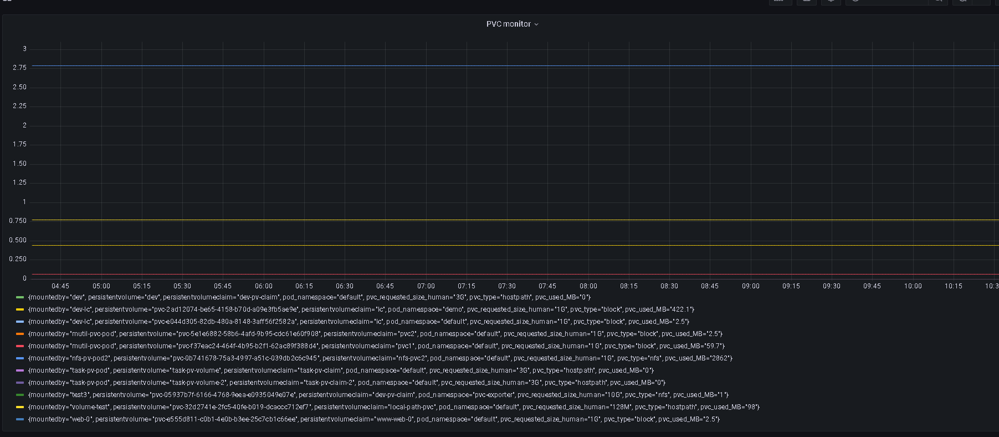

# pvc-exporter

  
This item provides 2 metrics,one for monitoring mounted pvc usage named **pvc_usage**, and one for provides the mapping between pod and pvc named **pvc_mapping**.

# Note
Only used to monitor mounted pvc that provied by block storage provisioner. Such as longgorn,trident,rook-ceph,etc..

# Support list
The following storage provisioners has been tested..  
1.longgorn  
2.trident  
3.rook-ceph  
4.aliyun flexvolume  
5.iomesh  
6.nutanix-csi  

The following architecture:  
1.x86_64  
2.ARM64  

 
# Usage
    helm repo add pvc-exporter https://kais271.github.io/pvc-exporter/helm3/charts/
    helm install demo pvc-exporter/pvc-exporter --version v0.1.2-beta

# Promethesus & Grafana

You can use this expression **" (sum without (container,pod,service,namespace,job,instance,endpoint) (pvc_usage)) + on(volumename) group_left(persistentvolumeclaim,mountedby,pod_namespace)pvc_mapping*0 "** to grafana to monitor pvc usage.  

